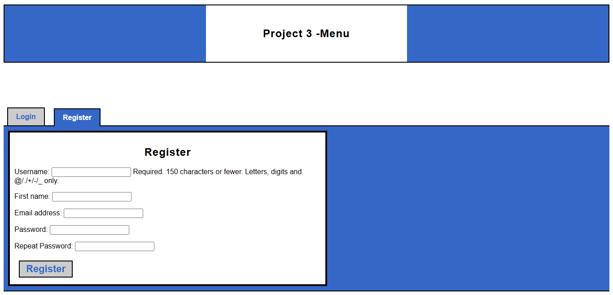

# Project 3: Pizza

🗪 README.md en español: [README_ES.md](README_ES.md)


## Objective

Develop a full-featured web application using Django for managing online pizza orders, gaining familiarity with the framework and the design of relational databases.

---

## Overview

This system allows users to browse the menu, customize items, add them to a persistent cart, and place orders. Administrators can manage products and orders through the admin panel. The application replicates the menu of [Pinocchio’s Pizza & Subs](https://www.pinocchiospizza.net/menu.html), with a similar visual interface that emphasizes clarity, organization, and usability.

---

## Screenshots

### Main Menu


### Shopping Cart


### User Registration



### Login


---

## Key Features

* **Menu Navigation**: Full reproduction of the original menu, including sizes, ingredients, and customizable extras.
* **Product Management**: Admins can create, edit, and delete products, prices, and categories through the admin panel.
* **User Authentication**: User registration, login, and logout using Django’s built-in authentication system.
* **Persistent Cart**: Users can add customized products to a cart that persists across sessions.
* **Order Processing**: Users can review and confirm their order total before submission.
* **Order Management**: Admins can view and manage placed orders.
* **Custom UI**: Visual design inspired by the original menu, with clear navigation, visual feedback, and styled components.

---

## Installation and Execution

### 1. Clone the Repository

```bash
git clone https://github.com/Wesleykyle2005/Project-3-Pizza
cd Project-3-Pizza
```

### 2. Create a Virtual Environment (optional but recommended)

```bash
# Windows
python -m venv venv
venv\Scripts\activate

# Mac/Linux
python3 -m venv venv
source venv/bin/activate
```

### 3. Install Dependencies

```bash
pip install -r requirements.txt
```

### 4. Apply Migrations

```bash
python manage.py makemigrations
python manage.py makemigrations orders
python manage.py migrate
```

### 5. Load Initial Menu

```bash
python load_data.py
```

### 6. Create a Superuser (optional)

```bash
python manage.py createsuperuser
```

### 7. Run the Server

```bash
python manage.py runserver
```

### 8. Access the Application

* Main site: [http://127.0.0.1:8000/](http://127.0.0.1:8000/)
* Admin panel: [http://127.0.0.1:8000/admin/](http://127.0.0.1:8000/admin/)

---

## Project Structure

* `orders/`: Business logic for menu, cart, and orders
* `users/`: User authentication and operations
* `pizza/`: Main Django project configuration
* `load_data.py`: Script to automatically load the initial menu
* `requirements.txt`: Environment dependencies (Django)
* `README.md`: Technical documentation and installation guide

---

## Data Model

* **Category**: Groups products by type and defines whether they are main or complementary.
* **Product**: Base menu item, optionally associated with extras and restrictions.
* **MenuItem**: Variant of a product with size and price (e.g., large pizza).
* **Selection**: Customized product added to the cart.
* **Order**: Represents a complete order with all selected items.

The data structure allows modeling products with or without sizes, customizable options, and flexible pricing logic according to the rules of the original menu.

[](https://mermaid.live/edit#pako:eNqNVMFu2zAM_RWDpxZzgjhOHEforbvsUGzAsMumwlBtxRFqUYEkA02D_Ptox3bazFmbS0SK5Hvko3WA3BQSGOSVcO6rEqUVmiPH1g7uhZelsfvgwDGg3xdVBCxQ6DsThZbkcN52jmeFxckR_OGws0oLu-cQBpyA9M6gRO9OtigK5ZVBMh85Hs-gP6wp6tx_GlO-eCtcJrSp0b8LzTv62UWJLmPk-g2NB4n1Ny_1NR5Ovcpzq06Lqjo1VglbyrapNo6GkDeBhcxpGtXgbZsch_4pK5k3s7mGbWwhrWx8T8b0JWsn7WWn3nhRZa7WN7f_UMgy4p5lN7cj2LL4X-uK7i6RXM95vKXvDeNr9XIrSYrGV9C_V1p2FxuFym3fNNpWHLaSQ8QhuJtM6KQF0qINy8OCXt3Pxl8sBcf-aiRr2A0WdEJyPIs2kvBuqrQ0fSzHodTHWc3YOf4ima8HN_gsaFaB42nmH4QOVBxHCKG0qgDmbS1D0NJq0ZjQ6sbBbyVJA4yOT8LRiQShnJ3A38boPs2autwC24jKkVXvGk27l2UIkUjU7psPFlgyj9sawA7wAixeT6NVuopm0SxN1sv1MoQ9sMl8kU7niziK4zRezWdRujiG8NrCRtOEXHESRWkcJclytghB0uNi7EP3uBncqBKOfwE0HJXo)

---

## Admin Panel

* Interface for visual management of categories, products, variants, and orders.
* Supports bulk editing and attribute-based filters.
* Order status can be modified by the administrator.

---

## User Interface

* Visually based on [Pinocchio’s Pizza & Subs](https://www.pinocchiospizza.net/menu.html) menu.
* Anchor-based navigation between menu categories.
* Flat buttons with hover effects and consistent styles.
* Clear visual feedback in cart and checkout flow.
* Unified tables and readable typography across views.

---

## Customization and Extensibility

* Flexible system for product customization.
* Documented and extensible architecture.
* Modern and consistent aesthetics.
* Includes technical and visual documentation.

---

## Credits

* Project based on the CS50W specification.
* Inspired by the menu and visual style of [Pinocchio’s Pizza & Subs](https://www.pinocchiospizza.net/menu.html).