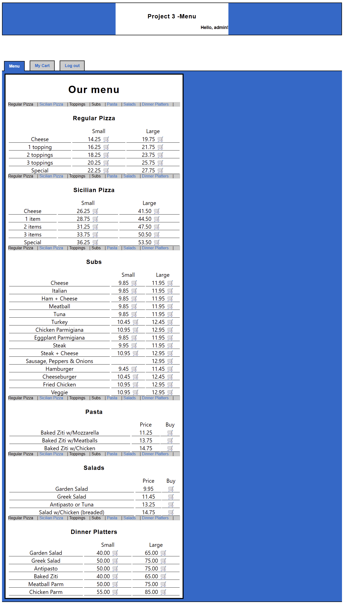
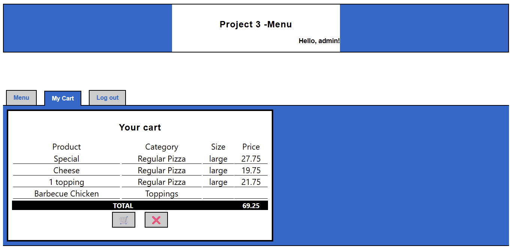
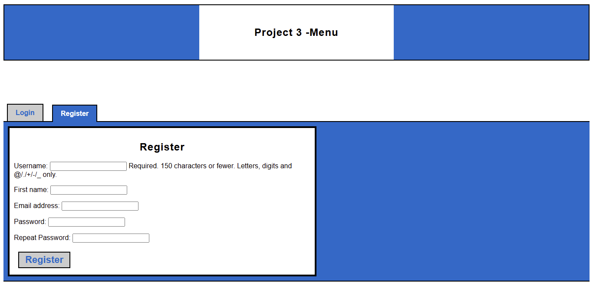
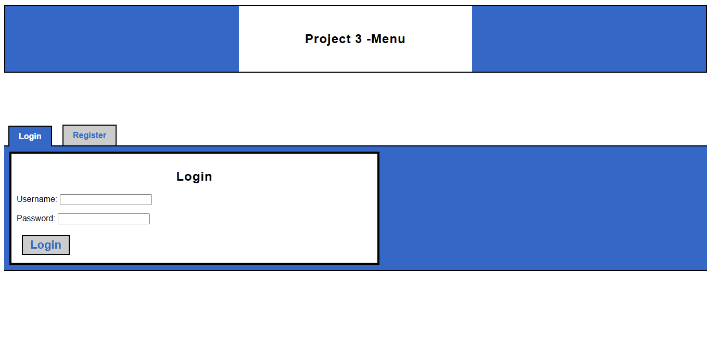

# Proyecto 3: Pizza

## Objetivo

Desarrollar una aplicación web completa utilizando Django para la gestión de pedidos en línea de una pizzería, familiarizándose con el framework y el diseño de bases de datos relacionales.

---

## Descripción General

Este sistema permite a los usuarios navegar por el menú, personalizar productos, agregarlos a un carrito persistente y realizar pedidos. Los administradores pueden gestionar productos y pedidos a través del panel de administración. La aplicación replica el menú de [Pinocchio’s Pizza & Subs](https://www.pinocchiospizza.net/menu.html), con una interfaz visual similar que prioriza la claridad, organización y usabilidad.

---

## Capturas de Pantalla

### Menú Principal


### Carrito de Compras


### Registro de Usuario


### Inicio de Sesión


---

## Funcionalidades Principales

- **Navegación de Menú**: Reproducción completa del menú original, incluyendo tamaños, ingredientes y extras personalizables.
- **Gestión de Productos**: Los administradores pueden crear, editar y eliminar productos, precios y categorías desde el panel administrativo.
- **Autenticación de Usuarios**: Registro, inicio y cierre de sesión mediante el sistema de autenticación nativo de Django.
- **Carrito Persistente**: Los usuarios pueden añadir productos personalizados a su carrito, el cual se conserva entre sesiones.
- **Proceso de Pedido**: Confirmación y visualización del total del pedido antes de su envío.
- **Gestión de Pedidos**: Visualización y administración de pedidos realizados por parte de los administradores.
- **Interfaz Personalizada**: Diseño visual inspirado en el menú original, con navegación clara, retroalimentación visual y componentes estilizados.

---

## Instalación y Ejecución

### 1. Clonar el Repositorio
```bash
git clone https://github.com/Wesleykyle2005/Project-3-Pizza
cd Project-3-Pizza
````

### 2. Crear un Entorno Virtual (opcional pero recomendado)

```bash
# Windows
python -m venv venv
venv\Scripts\activate

# Mac/Linux
python3 -m venv venv
source venv/bin/activate
```

### 3. Instalar Dependencias

```bash
pip install -r requirements.txt
```

### 4. Aplicar Migraciones

```bash
python manage.py makemigrations
python manage.py makemigrations orders
python manage.py migrate
```

### 5. Cargar el Menú Inicial

```bash
python load_data.py
```

### 6. Crear un Superusuario (opcional)

```bash
python manage.py createsuperuser
```

### 7. Ejecutar el Servidor

```bash
python manage.py runserver
```

### 8. Acceder a la Aplicación

* Sitio principal: [http://127.0.0.1:8000/](http://127.0.0.1:8000/)
* Panel de administración: [http://127.0.0.1:8000/admin/](http://127.0.0.1:8000/admin/)

---

## Estructura del Proyecto

* `orders/`: Lógica de negocio del menú, carrito y pedidos.
* `users/`: Gestión de autenticación y operaciones de usuario.
* `pizza/`: Configuración principal del proyecto Django.
* `load_data.py`: Script para cargar el menú inicial automáticamente.
* `requirements.txt`: Dependencias del entorno (Django).
* `README.md`: Documentación técnica y guía de instalación.

---

## Modelo de Datos

* **Categoría**: Agrupa productos por tipo y define si son principales o complementarios.
* **Producto**: Elemento base del menú, con posibilidad de asociar extras y restricciones.
* **MenuItem**: Variante de un producto con tamaño y precio (e.g., pizza grande).
* **Selección**: Producto personalizado agregado al carrito.
* **Order**: Representa un pedido completo, con todas las selecciones realizadas.

La estructura de datos permite representar productos con o sin tamaños, con opciones personalizables y lógica de precios flexible según las reglas del menú original.

[](https://mermaid.live/edit#pako:eNqNVMFu2zAM_RWDpxZzgjhOHEforbvsUGzAsMumwlBtxRFqUYEkA02D_Ptox3bazFmbS0SK5Hvko3WA3BQSGOSVcO6rEqUVmiPH1g7uhZelsfvgwDGg3xdVBCxQ6DsThZbkcN52jmeFxckR_OGws0oLu-cQBpyA9M6gRO9OtigK5ZVBMh85Hs-gP6wp6tx_GlO-eCtcJrSp0b8LzTv62UWJLmPk-g2NB4n1Ny_1NR5Ovcpzq06Lqjo1VglbyrapNo6GkDeBhcxpGtXgbZsch_4pK5k3s7mGbWwhrWx8T8b0JWsn7WWn3nhRZa7WN7f_UMgy4p5lN7cj2LL4X-uK7i6RXM95vKXvDeNr9XIrSYrGV9C_V1p2FxuFym3fNNpWHLaSQ8QhuJtM6KQF0qINy8OCXt3Pxl8sBcf-aiRr2A0WdEJyPIs2kvBuqrQ0fSzHodTHWc3YOf4ima8HN_gsaFaB42nmH4QOVBxHCKG0qgDmbS1D0NJq0ZjQ6sbBbyVJA4yOT8LRiQShnJ3A38boPs2autwC24jKkVXvGk27l2UIkUjU7psPFlgyj9sawA7wAixeT6NVuopm0SxN1sv1MoQ9sMl8kU7niziK4zRezWdRujiG8NrCRtOEXHESRWkcJclytghB0uNi7EP3uBncqBKOfwE0HJXo)

---

## Panel de Administración

* Interfaz para la gestión visual de categorías, productos, variantes y pedidos.
* Soporte para edición en lote y filtros por atributos.
* Estado de pedidos modificable por el administrador.

---

## Interfaz de Usuario

* Basada visualmente en el menú de [Pinocchio’s Pizza & Subs](https://www.pinocchiospizza.net/menu.html).
* Navegación por anclas entre categorías del menú.
* Botones planos con efectos hover y estilos consistentes.
* Retroalimentación visual clara en carrito y proceso de compra.
* Tablas unificadas y tipografía legible en todas las vistas.

---

## Personalización y Extensión

* Sistema flexible para personalización de productos.
* Arquitectura documentada y extensible.
* Estética moderna y consistente.
* Documentación técnica y visual incluida.

---

## Créditos

* Proyecto basado en la especificación de CS50W.
* Inspirado por el menú y estilo visual de [Pinocchio’s Pizza & Subs](https://www.pinocchiospizza.net/menu.html).